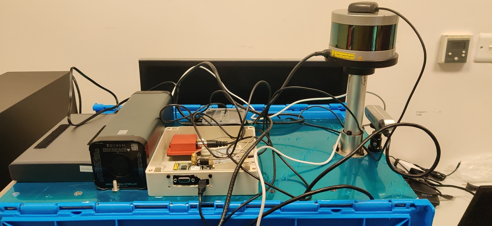
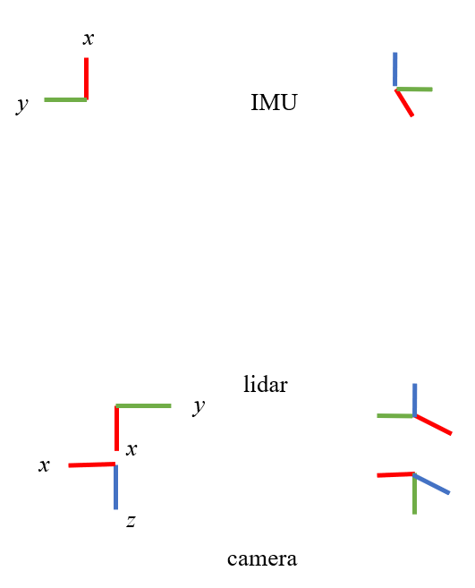
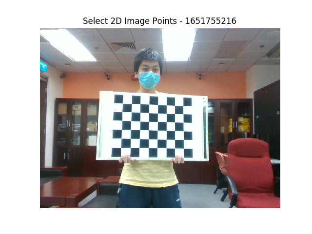
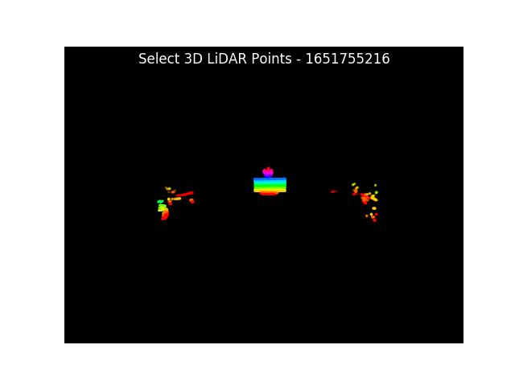
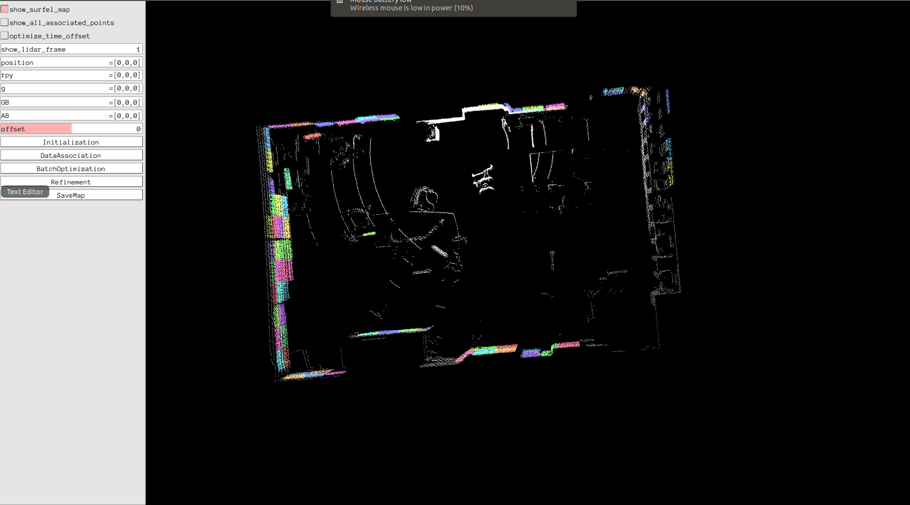

# step-by-step-multi-sensor-fusion

The aim of the project is to build a multi-sensor localization and mapping system. Its contents are related to the below toppics:
- `sensor assembling`
- `sensor testing` 
- `sychonization and calibration`
- `dataset recording`
- `main code of the multi-sensorlocalization and mapping system`

## sensor assembling

Four different sensors are utilized including:
- `GNSS receiver` ublox M8T
- `IMU` xsens-mti-g-710
- `camera` realsense D435
- `Lidar` VLP-16

`xsens-mti-g-710` is a GNSS/IMU sensor, which can outpus both GNSS position and IMU data.  `realsense D435` is stereo camera, which can output one RGB image, two IR images and one depth image at the same time, but only one RGB or IR will be used in this project.

The above sensors are assembled on a aluminum plate by screws.

<p align="center">
  
</p>
Their 2D(left) and 3D(right) body coordinate systems or are appoximate to: 
<p align="center">
  
</p>

## sensor testing

The ROS drivers of utilized sensors are installed and tested under the operation system `Ubuntu 18.04 + ROS melodic`.
-  [ublox driver](https://github.com/HKUST-Aerial-Robotics/ublox_driver) 
-  [xsens mti driver](http://wiki.ros.org/xsens_mti_driver)
-  [velodyne lidar driver](http://wiki.ros.org/velodyne/Tutorials/Getting%20Started%20with%20the%20Velodyne%20VLP16)
-  [realsense camera driver](https://github.com/IntelRealSense/realsense-ros)

There is also another [ublox ROS driver](https://github.com/KumarRobotics/ublox) maintained by [KumarRobotics](https://github.com/KumarRobotics), which is more popular. The output topics from these two drivers are different, but both can be transferred to `RINEX` file easily. `xsens-mti-g-710` can provide GNSS position, but its RAW GNSS measurments are not available, so `ublox M8T`is utilized.

## sensor calibration

The calibration includes two parts: 
- `time synchronization`
- `space calibaration`

Only a coarse time synchronization is performed to sycn the time clock between the computer and GNSS by
```
sudo su
source /opt/ros/kinetic/setup.bash
source ${YOUR_CATKIN_WORKSPACE}/devel/setup.bash
rosrun ublox_driver sync_system_time
```
Next step is to use PPSfrom the GNSS receiver to trigger all other sensors.

The space transformation between lidar and camera is computed by 3D-2D PnP algorithm implemented by [heethesh](https://github.com/heethesh/lidar_camera_calibration). Two example pics of manually picking 2D pixls and 3D points are shown below.

<p align="center">
  
  
</p>
The RMSE and transformation matrix:

```
RMSE of the 3D-2D reprojection errors: 1.194 pixels. 
T_lidar_cam:[
-0.05431967, -0.99849605,  0.0074169, 0.04265499, 
0.06971394, -0.01120208, -0.99750413, -0.16234957,
0.99608701, -0.05366703,  0.07021759, -0.03513243,
0, 0, 0, 1]
```

The The space transformation between lidar and IMU is computed by (a) hand-eye calibration and (b) batch optimization, implemented by [APRIL-ZJU](https://github.com/APRIL-ZJU/lidar_IMU_calib). One example calibration image is shown below.

<p align="center">
  
</p>

The transformation matrix and time offest:
``` 
T_imu_lidar:[
-0.9935967, 0.1120969, -0.0141367, -0.276365, 
-0.1121103, -0.9936957, 0.0001571, -0.0448481 ,
-0.0140300, 0.0017409, 0.9999000, 0.155901,
0, 0, 0, 1]
time offset: -0.015
```

 Also, the intrtrinsic calibration parameters of the color camera inside realsense D435 is
 
 ```
 height: 480
 width: 640
 distortion_model: "plumb_bob"
 D: [0.0, 0.0, 0.0, 0.0, 0.0]
 K: [618.8675537109375, 0.0, 315.9486083984375, 0.0, 619.0439453125, 246.67913818359375, 0.0, 0.0, 1.0]
 R: [1.0, 0.0, 0.0, 0.0, 1.0, 0.0, 0.0, 0.0, 1.0]
 P: [618.8675537109375, 0.0, 315.9486083984375, 0.0, 0.0, 619.0439453125, 246.67913818359375, 0.0, 0.0, 0.0, 1.0, 0.0]
 ```
 
 ## dataset recording
 
 Before mounting the sensor platform on a real vehicle, I put it on a trolly to collect datasets with my laptop. The test dataset is stored on [google drive](https://drive.google.com/file/d/1J6ti1XpPPSNJgayWC-zmRKHtfiP7bKc1/view?usp=sharing).
 The scripts to collect the datasets are:
 ```
 1. open one terminal to launch VLP-16
    source ${YOUR_CATKIN_WORKSPACE}/devel/setup.bash
    roslaunch velodyne_pointcloud VLP16_points.launch
 2. open one terminal to launch realsense D435 camera
    source ${YOUR_CATKIN_WORKSPACE}/devel/setup.bash
    roslaunch realsense2_camera rs_camera.launch
 3. open one terminal to launch xsens-mti-g-710
    source ${YOUR_CATKIN_WORKSPACE}/devel/setup.bash
    roslaunch xsens_mti_driver xsens_mti_node.launch 
 4. open one terminal to launch ublox M8T
    source ${YOUR_CATKIN_WORKSPACE}/devel/setup.bash 
    roslaunch ublox_driver ublox_driver.launch
 5. wait until the ublox output is stable and then sync time
    sudo su
    source /opt/ros/melodic/setup.bash
    source ${YOUR_CATKIN_WORKSPACE}/devel/setup.bash
    rosrun ublox_driver sync_system_time
 6. use [rviz] or [rostopic echo] to check the relative messages, if all of them are valid,record the relative topics
    rosbag record /camera/color/image_raw /velodyne_points /gnss /filter/positionlla /filter/quaternion /imu/data /ublox_driver/ephem /ublox_driver/glo_ephem     /ublox_driver/iono_params /ublox_driver/range_meas /ublox_driver/receiver_lla /ublox_driver/receiver_pvt /ublox_driver/time_pulse_info
 ```
 These topics are about:
 - `/camera/color/image_raw` is the color image data from `realsense D435` .
 - `/velodyne_points` is the lidar points from `VLP-16`.
 - `/imu/data` is the imu data from `xsens-mti-g-710`
 - `/gnss` is the GNSS output from `xsens-mti-g-710`
 - `/filter/positionlla` is the filtered position from `xsens-mti-g-710`
 - `/filter/quaternion` is the filter quaternion from `xsens-mti-g-710`
 - others are from ublox `M8T`
 
 
 
 
 

   


